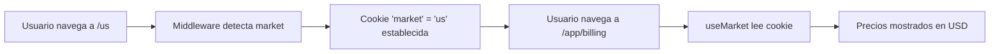

# Correcciones de i18n y Market Switcher

## Fecha: 2026-01-14

## Problemas Resueltos

### 1. **Mensajes hardcodeados en español** ❌ → ✅

**Problema:**
- Al cancelar a free, el popup mostraba "Suscripción cancelada exitosamente" en español, incluso en market US (inglés)
- Otros mensajes también estaban hardcodeados

**Causa:**
- Los mensajes usaban strings literales en lugar de traducciones del sistema i18n

**Solución:**
Agregamos nuevas claves de traducción y corregimos el código:

#### Archivos Modificados:

**1. `src/lib/i18n.ts`**
   
Agregamos 3 nuevas claves de traducción al interface `Translations.billing`:
```typescript
billing: {
    // ... claves existentes ...
    subscriptionCanceled: string;  // ✅ NUEVO
    planChanged: string;           // ✅ NUEVO
    errorProcessingPurchase: string; // ✅ NUEVO
}
```

Traducciones agregadas:

**Inglés (US):**
```typescript
subscriptionCanceled: 'Subscription successfully canceled',
planChanged: 'Plan change completed',
errorProcessingPurchase: 'Error processing purchase',
```

**Español (ES):**
```typescript
subscriptionCanceled: 'Suscripción cancelada exitosamente',
planChanged: 'Cambio de plan completado',
errorProcessingPurchase: 'Error al procesar la compra',
```

**Español (MX):**
```typescript
subscriptionCanceled: 'Suscripción cancelada exitosamente',
planChanged: 'Cambio de plan completado',
errorProcessingPurchase: 'Error al procesar la compra',
```

**2. `src/app/app/billing/page.tsx`**

Reemplazamos strings hardcodeados por traducciones:

```typescript
// ❌ Antes:
niceAlert('Suscripción cancelada exitosamente');
niceAlert('Cambio de plan completado');
niceAlert('Error al procesar la compra');

// ✅ Después:
niceAlert(t.billing.subscriptionCanceled);
niceAlert(t.billing.planChanged);
niceAlert(t.billing.errorProcessingPurchase);
```

---

### 2. **Market Switcher para Testing** ✅

**Necesidad:**
- Forma fácil de cambiar entre mercados (US/ES/MX) para testing
- Ver precios en diferentes monedas sin manipular cookies manualmente

**Solución:**
Creamos un componente `MarketSwitcher` visible en el header de la app.

#### Archivos Creados:

**1. `src/components/MarketSwitcher.tsx`**

Características:
- ✅ Muestra market actual con bandera y moneda
- ✅ Dropdown para cambiar entre US 🇺🇸, ES 🇪🇸, MX 🇲🇽
- ✅ Navegación automática a `/{market}` para establecer cookie
- ✅ UI moderna y accesible
- ✅ Tooltips informativos

```typescript
export default function MarketSwitcher() {
    const currentMarket = useMarket();
    const markets: Market[] = ['us', 'es', 'mx'];

    const handleMarketChange = (market: Market) => {
        // Navegación simple que establece la cookie automáticamente
        window.location.href = `/${market}`;
    };
    
    // ... UI component
}
```

**2. `src/components/AppHeader.tsx`**

Agregamos el MarketSwitcher al header:
```typescript
import MarketSwitcher from './MarketSwitcher'

// ...

<div className="flex items-center gap-4">
    {/* Token Balance */}
    <div className="hidden sm:flex items-center ...">
        {tokenBalance}
    </div>

    {/* ✅ Market Switcher (Testing Tool) */}
    <MarketSwitcher />

    {/* Upgrade Button */}
    ...
</div>
```

---

## Cómo Usar el Market Switcher

### Método 1: Usar el componente en el header
1. Ve a cualquier página de `/app/*` (dashboard, billing, etc.)
2. Mira el header, verás un botón con 🌍 y tu market actual (ej: "US ($)")
3. Haz click en el botón
4. Selecciona el market que quieres probar (US, ES, MX)
5. La página se recargará automáticamente con el nuevo market

### Método 2: Navegación directa (alternativa)
También puedes navegar directamente a:
- `https://floowvideos.com/us` → Market US (USD)
- `https://floowvideos.com/es` → Market ES (EUR)
- `https://floowvideos.com/mx` → Market MX (MXN)

Esto establecerá la cookie `market` que durará 90 días.

---

## Flujo del Market Cookie



### Prioridad del Market (en orden):
1. **URL params** (para rutas `[market]`) → `/es/`
2. **Pathname** (prefijo en URL) → `/mx/pricing`
3. **Cookie del navegador** → `market=us` ✅ **Importante para `/app/*`**
4. **Default** → `us`

---

## Testing Checklist

### ✅ Verificar Traducciones en Todos los Mercados:

**US Market (Inglés):**
```bash
# Navegar a /us, luego ir a /app/billing
# Bajar a free → Ver: "Subscription successfully canceled"
```

**ES Market (Español España):**
```bash
# Navegar a /es, luego ir a /app/billing
# Bajar a free → Ver: "Suscripción cancelada exitosamente"
```

**MX Market (Español México):**
```bash
# Navegar a /mx, luego ir a /app/billing
# Bajar a free → Ver: "Suscripción cancelada exitosamente"
```

### ✅ Verificar Market Switcher:

1. ✅ Aparece en el header
2. ✅ Muestra market actual correctamente
3. ✅ Al cambiar market, redirige a `/{market}`
4. ✅ Cookie se actualiza correctamente
5. ✅ Precios se actualizan al market seleccionado
6. ✅ Traducciones cambian según el market

---

## Archivos Modificados

### Archivos Editados:
1. ✅ `src/lib/i18n.ts` - Agregadas 3 nuevas claves de traducción
2. ✅ `src/app/app/billing/page.tsx` - Reemplazados mensajes hardcodeados
3. ✅ `src/components/AppHeader.tsx` - Agregado MarketSwitcher

### Archivos Creados:
1. ✅ `src/components/MarketSwitcher.tsx` - Nuevo componente

---

## Notas Importantes

### 1. **Cookie del Market**
- Nombre: `market`
- Duración: 90 días
- Scope: `/` (toda la app)
- Es crítica para que `useMarket()` funcione correctamente en rutas `/app/*`

### 2. **Cuando Remover el MarketSwitcher**
Este componente es principalmente para **testing y desarrollo**. En producción:
- **Opción 1:** Dejarlo visible solo en desarrollo
  ```typescript
  {process.env.NODE_ENV === 'development' && <MarketSwitcher />}
  ```
- **Opción 2:** Dejarlo visible siempre (los usuarios pueden querer cambiar de market)
- **Opción 3:** Removerlo completamente antes del launch

### 3. **Traducciones Futuras**
Para agregar nuevas traducciones:
1. Agregar clave al interface `Translations` en `src/lib/i18n.ts`
2. Agregar traducción en inglés a `EN_TRANSLATIONS`
3. Agregar traducción en español (ES) a `ES_ES_TRANSLATIONS`
4. Agregar traducción en español (MX) a `ES_MX_TRANSLATIONS`
5. Usar con `t.section.key` en el componente

### 4. **Diferencias ES vs MX**
Actualmente las traducciones son muy similares, pero podrías diferenciar:
- ES (España): "ordenador", "móvil", "euros"
- MX (México): "computadora", "celular", "pesos"

---

## Resumen de Bugs Corregidos

### ✅ Bug 1: Mensajes en español en market US
**Antes:** "Suscripción cancelada exitosamente" (en todos los markets)
**Después:** 
- US: "Subscription successfully canceled"
- ES: "Suscripción cancelada exitosamente"
- MX: "Suscripción cancelada exitosamente"

### ✅ Bug 2: Difícil cambiar de market para testing
**Antes:** Manipular cookie manualmente o navegar a rutas específicas
**Después:** Componente visual en header con 1 click

---

## Testing Rápido

```bash
# 1. Ir a US market
https://floowvideos.com/us

# 2. Navegar a billing
https://floowvideos.com/app/billing

# 3. Abrir consola y verificar cookie
document.cookie.split(';').find(c => c.includes('market'))
# Debería mostrar: "market=us"

# 4. Usar el MarketSwitcher en header para cambiar a ES

# 5. Verificar que cookie cambió
document.cookie.split(';').find(c => c.includes('market'))
# Debería mostrar: "market=es"

# 6. Bajar a free y verificar mensaje en español
```

---

## Próximos Pasos Recomendados

1. ⚠️ **Testing exhaustivo** de traducciones en todos los flujos
2. ⚠️ **Decidir** si mantener MarketSwitcher en producción o solo desarrollo
3. ⚠️ **Revisar** todas las páginas para encontrar más mensajes hardcodeados
4. ⚠️ **Considerar** agregar más diferencias entre ES y MX si es relevante
5. ⚠️ **Documentar** para el equipo cómo agregar nuevas traducciones

---

## Conclusión

✅ **Problema de i18n resuelto:** Todos los mensajes ahora usan el sistema de traducciones
✅ **Market Switcher implementado:** Testing multi-market ahora es fácil y rápido
✅ **UX mejorada:** Los usuarios ven mensajes en su idioma correcto
✅ **DX mejorada:** Los desarrolladores pueden cambiar markets con 1 click
