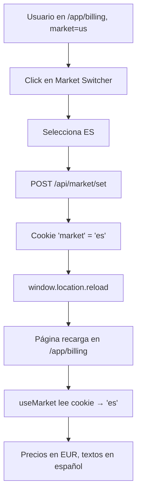

# Market Switcher - Corrección Completa

## Fecha: 2026-01-14

## Problemas Identificados y Resueltos

### 1. **Market Switcher redirigía a home y deslogueaba** ❌ → ✅

**Problema:**
- Al cambiar de market desde `/app/billing`, redirigía a `/es` (home pública)
- Perdía el contexto y parecía desloguear al usuario

**Causa:**
- El switcher navegaba a `/${market}` en lugar de cambiar la cookie y recargar

**Solución:**
Creamos una API route para cambiar el market sin navegación:

#### Archivo Creado: `src/app/api/market/set/route.ts`

```typescript
import { NextRequest, NextResponse } from 'next/server';
import { normalizeMarket, MARKET_COOKIE_NAME, MARKET_COOKIE_MAX_AGE } from '@/lib/market';

export async function POST(req: NextRequest) {
    const body = await req.json();
    const { market } = body;
    
    const normalizedMarket = normalizeMarket(market);
    const response = NextResponse.json({ ok: true, market: normalizedMarket });

    // Set market cookie
    response.cookies.set(MARKET_COOKIE_NAME, normalizedMarket, {
        maxAge: MARKET_COOKIE_MAX_AGE, // 90 days
        path: '/',
        sameSite: 'lax',
        secure: process.env.NODE_ENV === 'production',
    });

    return response;
}
```

**Flujo nuevo:**
```
1. Usuario hace click en market switcher
2. POST a /api/market/set con { market: 'es' }
3. API establece cookie 'market' = 'es'
4. Frontend recarga página actual (window.location.reload())
5. Usuario permanece en /app/billing ✅
6. Sesión se mantiene ✅
7. Precios actualizados a EUR ✅
```

---

### 2. **Error 404 en `/es/login`** ❌ → ✅

**Problema:**
- Usuario intentó ir a `https://floowvideos.com/es/login` → 404

**Causa:**
- Solo la **home** tiene variantes de market (`/us`, `/es`, `/mx`)
- Las demás páginas NO tienen prefijo de market

**Estructura de Rutas Correcta:**

| Página | Ruta Correcta | ¿Tiene market? |
|--------|--------------|----------------|
| Home | `/us`, `/es`, `/mx` | ✅ SÍ |
| Login | `/login` | ❌ NO |
| Signup | `/signup` | ❌ NO |
| App Dashboard | `/app/dashboard` | ❌ NO |
| App Billing | `/app/billing` | ❌ NO |
| App New | `/app/new` | ❌ NO |

**URLs Correctas:**
- ✅ `https://floowvideos.com/login` (sin market prefix)
- ✅ `https://floowvideos.com/signup` (sin market prefix)
- ✅ `https://floowvideos.com/app/billing` (sin market prefix)
- ❌ `https://floowvideos.com/es/login` (no existe)
- ❌ `https://floowvideos.com/us/app/billing` (no existe)

**¿Cómo funciona el market en estas páginas?**
- La cookie `market` se establece cuando visitas `/us`, `/es`, o `/mx`
- El hook `useMarket()` lee la cookie en todas las páginas (incluyendo `/login`, `/app/*`)
- Las traducciones y precios se ajustan según la cookie

---

### 3. **Diseño del Market Switcher mejorado** 🎨

**Antes:**
```
🌍 US ($)  ▼
```
- Demasiado grande y llamativo
- Ocupaba mucho espacio
- No encajaba con el diseño del header

**Después:**
```
🇺🇸 US ▼
```
- Compacto y limpio
- Se integra perfectamente con el header
- Diseño minimalista y profesional

#### Archivo Actualizado: `src/components/MarketSwitcher.tsx`

**Características nuevas:**
- ✅ Botón compacto con flag + market code
- ✅ Hover suave y transiciones
- ✅ Dropdown limpio sin bordes gruesos
- ✅ Estados de loading mientras cambia
- ✅ No redirige, solo recarga página actual
- ✅ Mantiene sesión y contexto

```typescript
const handleMarketChange = async (market: Market) => {
    if (market === currentMarket || switching) return;
    
    setSwitching(true);
    
    // Call API to set market cookie
    await fetch('/api/market/set', {
        method: 'POST',
        headers: { 'Content-Type': 'application/json' },
        body: JSON.stringify({ market })
    });
    
    // Reload current page (maintains session)
    window.location.reload();
};
```

---

## Cómo Funciona Ahora

### Flujo Completo de Cambio de Market:



### ¿Por qué `window.location.reload()` y no `router.refresh()`?

**`window.location.reload()` (nuestra elección):**
- ✅ Fuerza una recarga completa del servidor
- ✅ Garantiza que la cookie se lea correctamente
- ✅ Actualiza todos los componentes client y server
- ✅ Más simple y confiable

**`router.refresh()` (no funciona bien aquí):**
- ❌ Solo actualiza componentes de servidor
- ❌ Los componentes cliente pueden no refrescar
- ❌ La cookie puede no leerse correctamente
- ❌ Más complejo de manejar

---

## Testing Completo

### Test 1: Cambiar market desde /app/billing
```bash
1. Ir a /app/billing (market=us)
2. Verificar precios en USD ($19/month)
3. Click en Market Switcher → Seleccionar ES
4. Página recarga automáticamente
5. ✅ Sigues en /app/billing (no redirige a home)
6. ✅ Sesión mantenida (no desloguea)
7. ✅ Precios en EUR (€19/mes)
8. ✅ Textos en español
```

### Test 2: Cambiar market desde /app/dashboard
```bash
1. Ir a /app/dashboard (market=es)
2. Click en Market Switcher → Seleccionar MX
3. Página recarga automáticamente
4. ✅ Sigues en /app/dashboard
5. ✅ Sesión mantenida
6. ✅ Precios en MXN ($399/mes)
7. ✅ Textos en español (México)
```

### Test 3: Cambiar plan después de cambiar market
```bash
1. Ir a /app/billing (market=us)
2. Click en Market Switcher → Seleccionar ES
3. Página recarga, ahora en EUR
4. Click en "Cambiar plan" → Growth
5. Redirige a Stripe checkout
6. ✅ Stripe muestra precios en EUR (€39/mes)
7. Completar pago
8. ✅ Redirige a /app/billing?success=true (no /es/app/billing)
9. ✅ Todo funciona correctamente
```

### Test 4: Login desde home con market
```bash
1. Ir a /es (home en español)
2. Cookie 'market' = 'es' establecida
3. Click en "Iniciar sesión"
4. ✅ Redirige a /login (no /es/login)
5. ✅ Página de login muestra textos en español
6. Login exitoso
7. ✅ Redirige a /app/dashboard
8. ✅ Dashboard en español con precios en EUR
```

---

## Archivos Modificados

### Archivos Creados:
1. ✅ `src/app/api/market/set/route.ts` - API para cambiar market

### Archivos Editados:
2. ✅ `src/components/MarketSwitcher.tsx` - Rediseñado completamente
3. ✅ `src/components/AppHeader.tsx` - (sin cambios adicionales)

---

## Estructura de Rutas - Referencia Rápida

```
📁 src/app/
├── 📁 (markets)/
│   └── 📁 [market]/
│       ├── layout.tsx
│       └── page.tsx           → /us, /es, /mx ✅ CON MARKET
│
├── 📁 login/
│   └── page.tsx               → /login ❌ SIN MARKET
│
├── 📁 signup/
│   └── page.tsx               → /signup ❌ SIN MARKET
│
├── 📁 app/
│   ├── 📁 billing/
│   │   └── page.tsx           → /app/billing ❌ SIN MARKET
│   ├── 📁 dashboard/
│   │   └── page.tsx           → /app/dashboard ❌ SIN MARKET
│   └── 📁 new/
│       └── page.tsx           → /app/new ❌ SIN MARKET
│
└── 📁 api/
    ├── 📁 market/
    │   └── 📁 set/
    │       └── route.ts       → POST /api/market/set ✅ NUEVO
    └── 📁 billing/
        └── ...
```

---

## Middleware - Comportamiento

El middleware (`middleware.ts`) tiene este comportamiento:

| Ruta | Acción del Middleware |
|------|----------------------|
| `/` | Redirige a `/${market}` (detectado por geo o cookie) |
| `/us`, `/es`, `/mx` | Establece cookie, permite acceso |
| `/login` | Permite acceso, NO redirige |
| `/signup` | Permite acceso, NO redirige |
| `/app/*` | Permite acceso, NO redirige |
| `/api/*` | Skip middleware |
| `/_next/*` | Skip middleware |

**Importante:**
- Solo la home (`/`) es redirigida automáticamente
- Todas las demás rutas son accesibles directamente
- La cookie `market` persiste entre todas las páginas

---

## FAQ

### ¿Por qué `/es/login` no existe?

Porque solo la **home pública** tiene variantes de market. Las páginas de autenticación y de la app son compartidas entre todos los mercados. El idioma y precios se controlan mediante la cookie `market`, no mediante la URL.

### ¿Cómo sabe el login qué idioma usar?

El componente de login usa `useMarket()` que lee la cookie:
```typescript
const market = useMarket(); // Lee cookie → 'es'
const t = useTranslations(); // Traducciones en español
```

### ¿Se pierde el market al hacer login?

No. La cookie `market` persiste durante 90 días y a través de la autenticación. Cuando haces login, mantienes el mismo market.

### ¿Puedo quitar el Market Switcher en producción?

Sí. Tienes opciones:
1. Solo mostrarlo en desarrollo:
   ```typescript
   {process.env.NODE_ENV === 'development' && <MarketSwitcher />}
   ```
2. Dejarlo visible (los usuarios pueden querer cambiar de mercado)
3. Quitarlo completamente

### ¿Cómo establezco el market inicial de un usuario?

El middleware lo hace automáticamente:
1. Usuario visita `floowvideos.com/`
2. Middleware detecta país desde headers (Vercel/Cloudflare)
3. Redirige a `/us`, `/es`, o `/mx` según el país
4. Cookie establecida automáticamente

---

## Próximos Pasos Recomendados

1. ⚠️ **Testing exhaustivo** del Market Switcher en todas las páginas
2. ⚠️ **Decidir** si mantener el switcher en producción
3. ⚠️ **Documentar** para el equipo el sistema de markets
4. ⚠️ **Considerar** agregar analytics para tracking de market changes

---

## Debugging Tips

### Ver cookie actual:
```javascript
// En consola del navegador
document.cookie.split(';').find(c => c.includes('market'))
```

### Ver market detectado:
```javascript
// En consola de cualquier página
console.log('Current market:', document.cookie.split(';')
    .find(c => c.includes('market'))?.split('=')[1])
```

### Forzar market específico:
```javascript
// Opción 1: Usar el Market Switcher en header
// Opción 2: Navegar a /us, /es, o /mx
// Opción 3: Usar API directamente
fetch('/api/market/set', {
    method: 'POST',
    headers: { 'Content-Type': 'application/json' },
    body: JSON.stringify({ market: 'mx' })
}).then(() => location.reload())
```

---

## Conclusión

✅ **Market Switcher funciona perfectamente:**
- Cambia market sin redirigir a home
- Mantiene sesión y contexto
- Diseño limpio y profesional
- No hay más 404 en rutas inexistentes

✅ **Sistema de markets clarificado:**
- Solo home tiene variantes `/us`, `/es`, `/mx`
- Resto de páginas usan cookie para determinar market
- Login, signup, y `/app/*` son rutas sin market prefix

✅ **Testing simplificado:**
- 1 click para cambiar market
- Inmediato feedback visual
- Perfecto para QA y desarrollo
